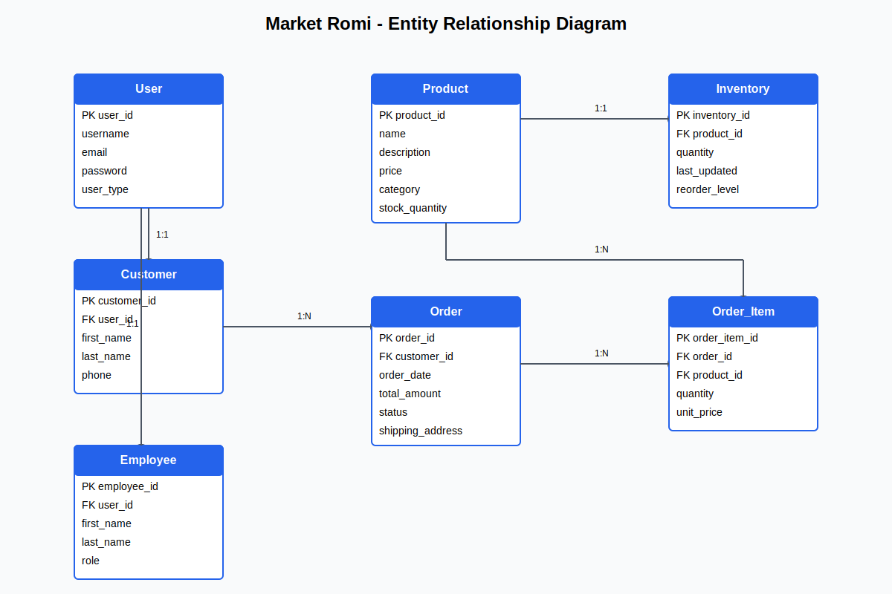

# Entity Relationship Diagram - Market Romi Store Management System

## Overview
This Entity Relationship Diagram (ERD) illustrates the database structure for the Market Romi Store Management System. It defines the main entities, their attributes, and the relationships between them.

## Entities

### User
The core entity that represents any user of the system, with attributes:
- Primary Key: `user_id`
- `username`
- `email`
- `password` (hashed)
- `user_type` (distinguishes between customers and employees)

### Customer
Represents retail customers who place orders:
- Primary Key: `customer_id`
- Foreign Key: `user_id` (links to User entity)
- Personal information: `first_name`, `last_name`, `phone`

### Employee
Represents staff members who operate the system:
- Primary Key: `employee_id`
- Foreign Key: `user_id` (links to User entity)
- Personal information: `first_name`, `last_name`
- `role` (defines staff responsibilities)

### Product
Contains information about items available for purchase:
- Primary Key: `product_id`
- Product details: `name`, `description`, `price`, `category`
- `stock_quantity` (current available stock)

### Order
Represents customer purchases:
- Primary Key: `order_id`
- Foreign Key: `customer_id` (links to Customer entity)
- Order information: `order_date`, `total_amount`, `status`, `shipping_address`

### Order_Item
Junction entity representing items within an order:
- Primary Key: `order_item_id`
- Foreign Keys: `order_id`, `product_id`
- Item details: `quantity`, `unit_price`

### Inventory
Tracks product stock levels:
- Primary Key: `inventory_id`
- Foreign Key: `product_id` (links to Product entity)
- Stock information: `quantity`, `last_updated`, `reorder_level`

## Relationships
- User to Customer: One-to-one relationship
- User to Employee: One-to-one relationship
- Customer to Order: One-to-many relationship (one customer can place many orders)
- Order to Order_Item: One-to-many relationship (one order can contain many items)
- Product to Order_Item: One-to-many relationship (one product can appear in many order items)
- Product to Inventory: One-to-one relationship

## Using This Diagram
This ERD serves as a blueprint for:
- Database implementation and structure
- Understanding data relationships
- Guiding query development
- Planning data migration strategies

## Diagram

