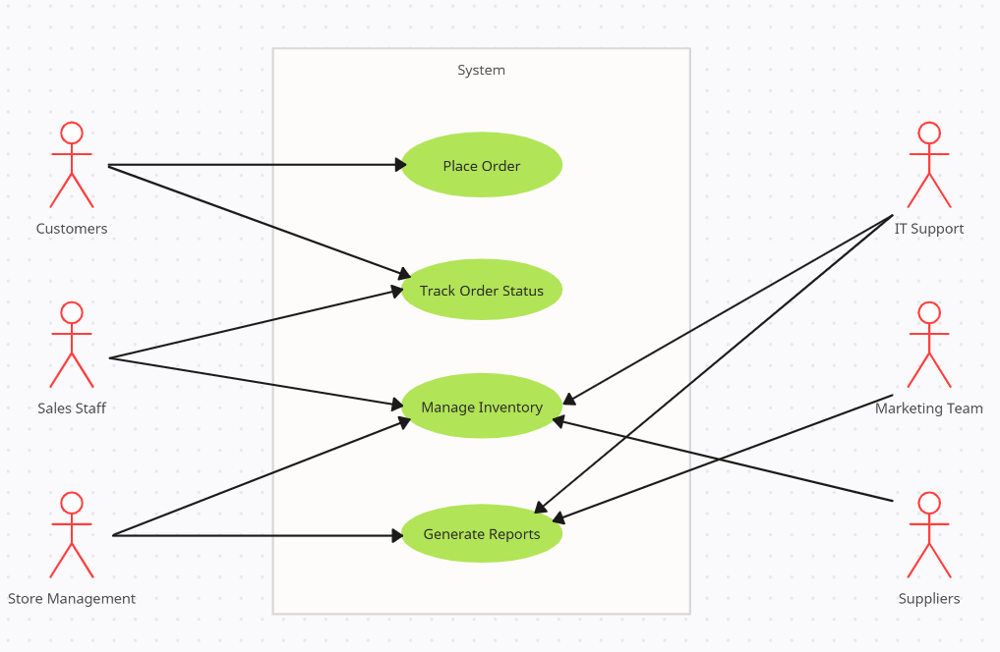

# Use Case Diagram for Store System Project

## Overview
This document outlines the use case diagram for the **Store System Project**. The system is designed to manage store operations, including placing orders, tracking order status, managing inventory, and generating reports. The use case diagram shows the various actors involved in the system and their interactions with the use cases.

## Actors
The system involves the following actors:

1. **Customers**  
   - Customers interact with the system to place orders and track the status of their orders.
   
2. **Sales Staff**  
   - Sales staff are responsible for managing inventory and tracking order status for customers.
   
3. **Store Management**  
   - Store management oversees the operations and ensures smooth execution of store functions. They also generate reports based on store activities.
   
4. **IT Support**  
   - IT support handles the technical aspects of the system, ensuring that the infrastructure and software are functioning as expected.

5. **Marketing Team**  
   - The marketing team is responsible for promotional activities and managing the store's branding.

6. **Suppliers**  
   - Suppliers provide the necessary inventory for the store and ensure that products are available for sale.

## Use Cases
The following use cases are part of the system:

1. **Place Order**  
   - Customers can place orders through the system.
   
2. **Track Order Status**  
   - Customers and sales staff can track the status of orders.

3. **Manage Inventory**  
   - Sales staff manage the store's inventory, including adding new stock and removing items.

4. **Generate Reports**  
   - Store management can generate reports on sales, inventory, and other metrics.

## Relationships between Actors and Use Cases
Here is a list of the key interactions between actors and use cases:

- **Customers**:
  - **Place Order**
  - **Track Order Status**
  
- **Sales Staff**:
  - **Track Order Status**
  - **Manage Inventory**
  
- **Store Management**:
  - **Generate Reports**
  
- **IT Support**:
  - **Technical Support for all use cases**

- **Marketing Team**:
  - **Promotion and Branding**

- **Suppliers**:
  - **Provide Inventory**

## Use Case Diagram

The diagram below shows the relationships between the actors and use cases in the system.

## How to Use This Diagram

1. **Place Order**:  
   - **Actor**: Customer  
   - **Description**: The customer places an order using the system. This may involve selecting products and specifying shipping details.

2. **Track Order Status**:  
   - **Actor(s)**: Customer, Sales Staff  
   - **Description**: Both customers and sales staff can track the status of an order in the system.

3. **Manage Inventory**:  
   - **Actor**: Sales Staff  
   - **Description**: The sales staff update and manage the inventory within the store system, including adding new items and updating stock quantities.

4. **Generate Reports**:  
   - **Actor**: Store Management  
   - **Description**: Store management can generate various reports based on data from the system, such as sales performance and inventory levels.

5. **Provide Inventory**:  
   - **Actor**: Suppliers  
   - **Description**: Suppliers ensure the store is stocked with products by providing necessary inventory.

6. **Promotion and Branding**:  
   - **Actor**: Marketing Team  
   - **Description**: The marketing team handles the branding and promotion of the store, including discounts and campaigns.

