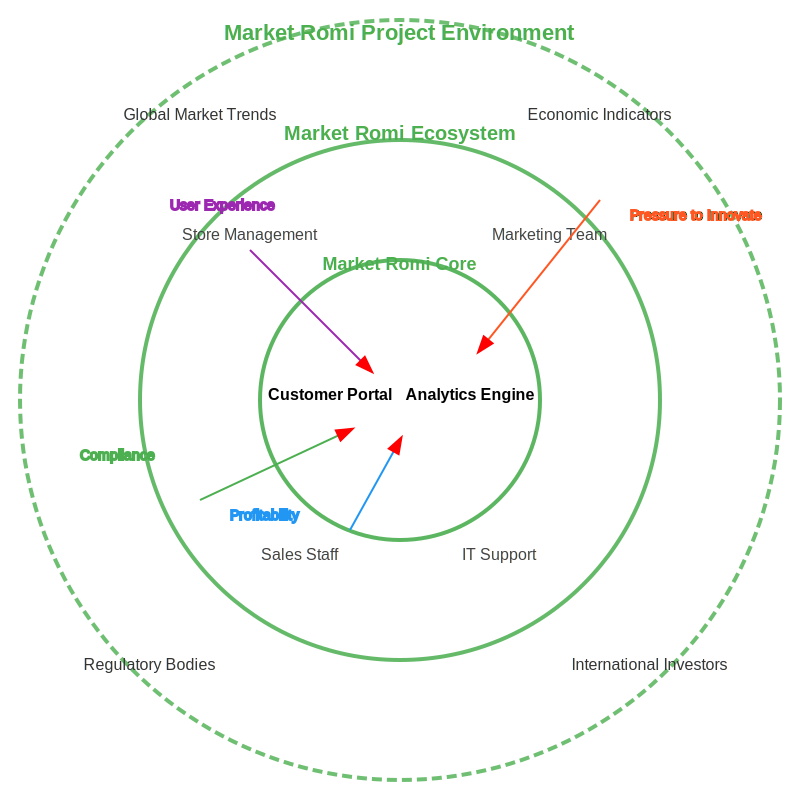

# Market Romi Project Documentation

## Requirements Specification

### Functional Requirements

| ID | Requirement Type | Description | Priority |
|----|------------------|-------------|----------|
| FR1 | Functional | Users shall be able to create accounts and access the Market Romi platform. | High |
| FR2 | Functional | The system shall provide comprehensive market analysis tools for different industries. | High |
| FR3 | Functional | Users shall be able to generate custom financial reports and insights. | High |
| FR4 | Functional | The system shall offer comparative market benchmarking features. | High |
| FR5 | Functional | Users shall be able to customize dashboard views and data visualizations. | Medium |
| FR6 | Functional | The system shall generate dynamic pricing and trend analysis. | High |
| FR7 | Functional | The platform shall provide interactive data exploration tools. | Medium |
| FR8 | Functional | Users shall be able to track and monitor market indicators in real-time. | High |
| FR9 | Functional | The system shall support integrated communication and collaboration features. | Medium |
| FR10 | Functional | Administrators shall have comprehensive user management capabilities. | High |
| FR11 | Functional | The system shall support detailed activity and performance logging. | High |
| FR12 | Functional | Users shall be able to export data in multiple formats (CSV, PDF, etc.). | Medium |
| FR13 | Functional | The platform shall offer predictive market trend modeling. | Medium |
| FR14 | Functional | The system shall generate comprehensive financial and performance reports. | High |
| FR15 | Functional | Users shall receive personalized market insights and recommendations. | High |

### Non-Functional Requirements

| ID | Requirement Type | Description | Priority |
|----|------------------|-------------|----------|
| NFR1 | Non-Functional | The system shall have a response time of less than 2 seconds for most operations. | High |
| NFR2 | Non-Functional | The platform shall ensure robust data security and encryption. | High |
| NFR3 | Non-Functional | The system shall be fully responsive across mobile and desktop devices. | Medium |
| NFR4 | Non-Functional | Automatic data backup and recovery mechanisms shall be implemented. | Medium |
| NFR5 | Non-Functional | The platform shall support at least 200 concurrent users. | High |
| NFR6 | Non-Functional | The user interface shall be intuitive and user-friendly. | High |

## Project Visualization

### Onion Diagram

  

1. **Wider Environment**: 
   - Global Market Trends
   - Economic Indicators
   - Regulatory Frameworks
   - International Investment Landscapes

2. **Containing System**:
   - Strategic Management
   - Business Intelligence Teams
   - Sales and Marketing Departments
   - Technology Infrastructure

3. **Core System**:
   - Market Analysis Portal
   - Predictive Analytics Engine

#### Pressure Vectors
- **Innovation Pressure**: Driving technological advancement
- **User Experience**: Enhancing platform usability and engagement
- **Market Competitiveness**: Ensuring strategic value proposition
- **Regulatory Compliance**: Maintaining industry standards and legal requirements
